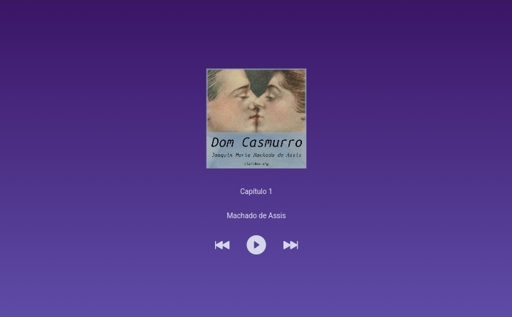

## 💽 Audiobook Dom Casmurro
Tocador de audiobook do clássico livro da literatura brasileira Dom Casmurro, de Machado de Assis. Foi um projeto feito durante o Intensivão de JavaScript da [Hashtag Treinamentos](https://youtube.com/@HashtagProgramacao?si=-M1aRzBpNVh4okNX), ótimo para praticar lógica de programação e conhecer melhor esse clássico da literatura brasileira.

***
## 🖥 Linguagens usadas
 

